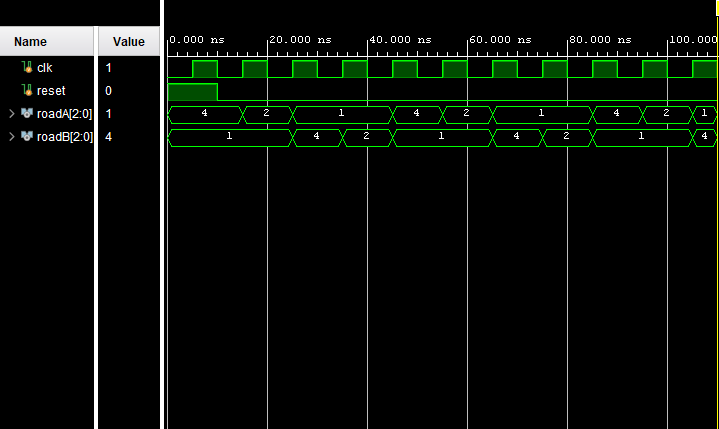

# Traffic Light Controller using Verilog FSM

## Overview

This project implements a **Traffic Light Controller** using a **Finite State Machine (FSM)** in Verilog HDL. The controller manages traffic flow between two roads by cycling through a sequence of traffic light states.

The design was simulated and verified using **Xilinx Vivado**, and the waveform confirms correct state transitions and signal generation.

---

## Objective

The objective of this project is to:

- Understand Finite State Machine (FSM) design.
- Implement sequential logic using Verilog HDL.
- Control traffic signals for two roads.
- Simulate and verify state transitions using Vivado.
- Learn state encoding and output logic design.

---

## Traffic Light Configuration

Each road has three possible signal states:

| Light | Binary Code |
|---------|------------|
| Green | 100 |
| Yellow | 010 |
| Red | 001 |

---

## FSM State Diagram

```text
          +----------------+
          |      S0        |
          | A=Green B=Red  |
          +----------------+
                   |
                   v
          +----------------+
          |      S1        |
          | A=Yellow B=Red |
          +----------------+
                   |
                   v
          +----------------+
          |      S2        |
          | A=Red B=Green  |
          +----------------+
                   |
                   v
          +----------------+
          |      S3        |
          | A=Red B=Yellow |
          +----------------+
                   |
                   v
                 S0
```

---

## State Description

| State | Road A | Road B |
|---------|---------|---------|
| S0 | Green | Red |
| S1 | Yellow | Red |
| S2 | Red | Green |
| S3 | Red | Yellow |

The controller continuously cycles through these states.

---

## State Encoding

| State | Binary |
|---------|---------|
| S0 | 00 |
| S1 | 01 |
| S2 | 10 |
| S3 | 11 |

---

# Verilog Design Code

## traffic_light.v

```verilog
module traffic_light(
    input clk,
    input reset,
    output reg [2:0] roadA,
    output reg [2:0] roadB
);

reg [1:0] state;

parameter S0 = 2'b00;
parameter S1 = 2'b01;
parameter S2 = 2'b10;
parameter S3 = 2'b11;

always @(posedge clk or posedge reset)
begin
    if(reset)
        state <= S0;
    else
        case(state)
            S0: state <= S1;
            S1: state <= S2;
            S2: state <= S3;
            S3: state <= S0;
        endcase
end

always @(*)
begin
    case(state)

        S0:
        begin
            roadA = 3'b100;
            roadB = 3'b001;
        end

        S1:
        begin
            roadA = 3'b010;
            roadB = 3'b001;
        end

        S2:
        begin
            roadA = 3'b001;
            roadB = 3'b100;
        end

        S3:
        begin
            roadA = 3'b001;
            roadB = 3'b010;
        end

        default:
        begin
            roadA = 3'b001;
            roadB = 3'b001;
        end

    endcase
end

endmodule
```

---

# Testbench

## traffic_light_tb.v

```verilog
`timescale 1ns / 1ps

module traffic_light_tb;

reg clk;
reg reset;

wire [2:0] roadA;
wire [2:0] roadB;

traffic_light uut(
    .clk(clk),
    .reset(reset),
    .roadA(roadA),
    .roadB(roadB)
);

always #5 clk = ~clk;

initial
begin
    clk = 0;
    reset = 1;

    #10;
    reset = 0;

    #100;

    $finish;
end

initial
begin
    $monitor("Time=%0t RoadA=%b RoadB=%b",
             $time, roadA, roadB);
end

endmodule
```

---

# Simulation Waveform



---

# Waveform Analysis

The waveform verifies the operation of the FSM.

### Initial Condition

When:

```text
reset = 1
```

The FSM enters State S0.

Outputs:

```text
Road A = Green
Road B = Red
```

Binary:

```text
RoadA = 100
RoadB = 001
```

Hexadecimal:

```text
RoadA = 4
RoadB = 1
```

---

## State S0

```text
Road A = Green
Road B = Red
```

Waveform Values:

```text
RoadA = 4
RoadB = 1
```

---

## State S1

```text
Road A = Yellow
Road B = Red
```

Waveform Values:

```text
RoadA = 2
RoadB = 1
```

---

## State S2

```text
Road A = Red
Road B = Green
```

Waveform Values:

```text
RoadA = 1
RoadB = 4
```

---

## State S3

```text
Road A = Red
Road B = Yellow
```

Waveform Values:

```text
RoadA = 1
RoadB = 2
```

---

## Observed Sequence

From the simulation waveform:

```text
RoadA : 4 → 2 → 1 → 1 → 4
RoadB : 1 → 1 → 4 → 2 → 1
```

This corresponds to:

```text
S0 → S1 → S2 → S3 → S0
```

which matches the expected FSM operation.

---

# Functional Verification

The simulation confirms that:

✔ Reset correctly initializes the FSM.

✔ State transitions occur on every positive edge of the clock.

✔ Traffic signals follow the intended sequence.

✔ Only one road receives a green signal at a time.

✔ No conflicting green signals occur.

✔ The FSM continuously cycles through all four states.

---

# Applications

Traffic Light Controllers are widely used in:

- Road Junction Signal Control
- Smart Traffic Management Systems
- Urban Transportation Systems
- Embedded Control Systems
- FSM-Based Digital Controllers
- FPGA-Based Control Applications

---

# Learning Outcomes

Through this project, the following concepts were learned:

- Finite State Machines (FSMs)
- Sequential Logic Design
- State Transition Logic
- Output Logic Design
- Verilog HDL Coding
- Behavioral Simulation
- Waveform Analysis
- Digital System Verification

---

# Conclusion

This project successfully implements a Traffic Light Controller using a Finite State Machine in Verilog HDL. The controller cycles through four traffic signal states and safely manages traffic flow between two roads. Simulation results obtained using Xilinx Vivado confirm correct state transitions and output generation, demonstrating the effectiveness of FSM-based control systems.

---

## Author

**Farhana N S**  
Electronics Engineering Student
